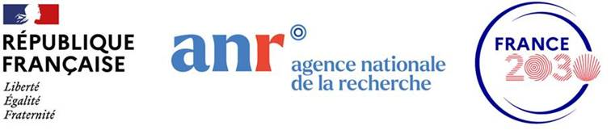

---
authors:
- laurent-u-perrinet
date: 2023-10-05 14:00:00
summary: Near-physics emerging models for embedded AI (PhD position, 2023 / 2027).
image:
  caption: Rufous Hummingbird "Super fast little hummer on a scarlet Kunzea plant, (thanks for the plant ID, Teddy) El Chorro regional park" photo [Anita Ritenour](https://www.flickr.com/photos/puliarfanita/13322040205) - Attribution 2.0 Generic (CC BY 2.0)
  focal_point: Smart
  placement: 2
  preview_only: false

links:
- name: URL
  url: https://emergences.lirmm.fr/
  
tags:
- grant
- current-grant

title: "Emergences (2023 / 2027)"
---

{}
TL;DR: Conventional deep learning models consume too much energy. Inspired by biology, we will explore new models that are more energy efficient.
{}

The [*Emergences* project](https://emergences.lirmm.fr/) aims at advancing the state-of-the art on near-physics emerging models by collaboratively exploring various computation models leveraging physical devices properties. This project will focus on Event-based models, Physics-inspired models and innovative near-physics Machine Learning solutions.
*Emergences* further intends to extend the collaborative research activities beyond the fence of the consortium by means of connecting with other projects of the PEPR IA and other research institutes.

* Pilote: Marina Reyboz, CEA, Research Director
* Co-Pilote: Gilles Sassatelli, CNRS, Research Director

## Description of the "*Emergences*" project

Contemporary machine learning (ML) has incurred profound changes in the scientific, societal and economic landscapes alike. After a decade of sustained progress AI as a discipline is still making regular breakthroughs on many fronts, at the expense of an ever-increasing amount of consumption of compute resources. Modern language models feature hundreds of billion parameters and training energy consumption alone likely falls in the GWh range, with a logical forecast worsening the already prohibitive carbon footprint of AI.

Besides the flourishing initiatives aimed at defining AI-friendly digital compute stack, the next logical breakthrough on the horizon is undoubtedly the emergence of disruptive AI compute technologies having improved energy efficiency. This development will likely involve the utilization of models that differ from those traditionally used in ML and exhibit properties that resemble the behavior of physical components, thereby facilitating implementation. 

The *Emergences* project aims at advancing the state-of-the art on near-physics emerging models by collaboratively exploring various computation models leveraging physical devices properties. Efforts will be put on 3 distinct fronts: Event-based models, Physics-inspired models (from physical systems dynamics) and innovative near-physics ML solutions (exploiting device properties). The investigations will be focused on embedded systems for Edge AI that call for increased energy efficiency for inference and learning, which could be incremental. They will apply to several application domains ranging for instance from the monitoring of the environment to health. Other important tasks such as common tools, performance metrics definition and model scalability analysis and will be conducted through as a collaborative transverse initiative.

*Emergences* further intends to extend the collaborative research activities beyond the fence of the consortium by means of connecting with other projects of the PEPR IA and other research institutes, some of which are listed in this proposal. Finally, because of the unavoidable societal and philosophical implications of AI as a whole, *Emergences* will concurrently to the research activities run a track aimed at analyzing and anticipating the impact of its upcoming contributions.

## Description of the PhD project (WP1): *Focus of attention: a sensory-motor task for energy reduction in unsupervised spiking neural networks*

* attention mechanisms based on our cognitive architecture using a dual pathway: 

* implementation in a spiking neural network based: 



## Key figures

 * starting date: September 1, 2023 
 * Duration: 48 months (until August 31, 2027)
 * 14 partners
 * Nb of PhD: 19
 * Nb of Post doc: 13
 * TRL: basic research
 * Total grant requested: 6.8 M€ 

- This work is supported by a public grant overseen by the French National Research Agency (ANR) under the grant number ANR-23-PEIA-0002 EMERGENCES.



## Latest news

- 2024-09-26: 2nd workshop meeting in Paris.

- 2023-10-05: Kick-off meeting!

