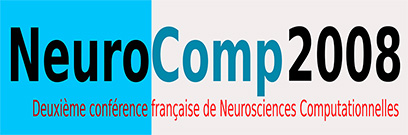

+++
title = "2010-05-27 : Neurocomp08"
subtitle = "2010-05-27 : Deuxième conférence française de Neurosciences Computationnelles"

date = 2010-05-27T00:00:00
lastmod = 2010-05-27T00:00:00
draft = false

# Authors. Comma separated list, e.g. `["Bob Smith", "David Jones"]`.
authors = ["laurent-u-perrinet"]

tags = ["events"]
summary = "La deuxième conférence française de Neurosciences Computationnelles, Neurocomp08, s'est déroulée à la Faculté de Médecine de Marseille du 8 au 11 octobre 2008."

# Projects (optional).
#   Associate this post with one or more of your projects.
#   Simply enter your project's folder or file name without extension.
#   E.g. `projects = ["deep-learning"]` references
#   `content/project/deep-learning/index.md`.
#   Otherwise, set `projects = []`.
projects = []

[image]
  placement = 2
  focal_point = "Center"
  preview_only = false
+++

# 2008-10-08 : Deuxième conférence française de Neurosciences Computationnelles, "Neurocomp08"

La deuxième conférence française de Neurosciences Computationnelles, "Neurocomp08", s'est déroulée à la Faculté de Médecine de Marseille du 8 au 11 octobre 2008. Cette conférence, organisée par le groupe de travail Neurocomp, a permis de réunir les principaux acteurs français du domaine (francophones ou non). Le champ des Neurosciences Computationnelles porte sur l'étude des mécanismes de calcul qui sont à l'origine de nos capacités cognitives. Cette approche nécessite l'intégration constructive de nombreux domaines disciplinaires, du neurone au comportement, des sciences du vivant à la modélisation numérique. Avec ce colloque, nous avons offert un lieu d'échanges afin de favoriser des collaborations interdisciplinaires entre des équipes relevant des neurosciences, des sciences de l'information, de la physique statistique, de la robotique. Cette édition a également été l'occasion d'ouvrir le cadre à de nouveaux domaines (modèles pour l'imagerie, interfaces cerveau-machine,...) notamment grâce à des ateliers thématiques (une nouveauté dans cette édition). Certains des principaux enjeux du domaine ont été présentés par quatre conférenciers invités : Ad Aertsen (Freiburg, Allemagne), Gustavo Deco (Barcelone, Espagne), Gregor Schöner (Bochum, Allemagne), Andrew B. Schwartz (Pittsburgh, USA). Des interventions orale plus courtes et plus spécifiques étaient également au programme, sur la base d'une sélection du comité de lecture. Une cinquantaine de posters ont également été présentés au cours de ces journées. Le premier jour était consacré aux modèles de la cellule neurale, aux modèles des traitements visuels et corticaux, ainsi qu'aux modèles de réseaux de neurones bio-mimétiques. La seconde journée était consacrée aux interfaces cerveau-machine, à la dynamique des grands ensembles de neurones, à la plasticité fonctionnelle et aux interfaces neurales. Enfin, la journée de samedi était consacrée à des ateliers thématiques, l'un sur les interfaces cerveau-machine, l'autre sur la vision computationnnelle. Cette conférence a connu un beau succès de par l'affluence (200 personnes environ) et la qualité des interventions. Ce succès tient également au fort soutien financier et organisationnel qu'elle a obtenu de ses partenaires. Les organisateurs remercient le CNRS, la Société des neurosciences, le conseil régional de la région Provence Alpes Côte d'Azur, le conseil général des Bouches de Rhône, la mairie de Marseille, l'université de Provence, l'IFR "Sciences du cerveau et de la cognition", l'INRIA, ainsi que la faculté de médecine de Marseille et l'université de la Méditerranée qui ont hébergé la conférence.

* Les actes de la conférence regroupant les 68 contributions sont disponibles sur le [serveur HAL dédié](http://hal.archives-ouvertes.fr/NEUROCOMP08).

