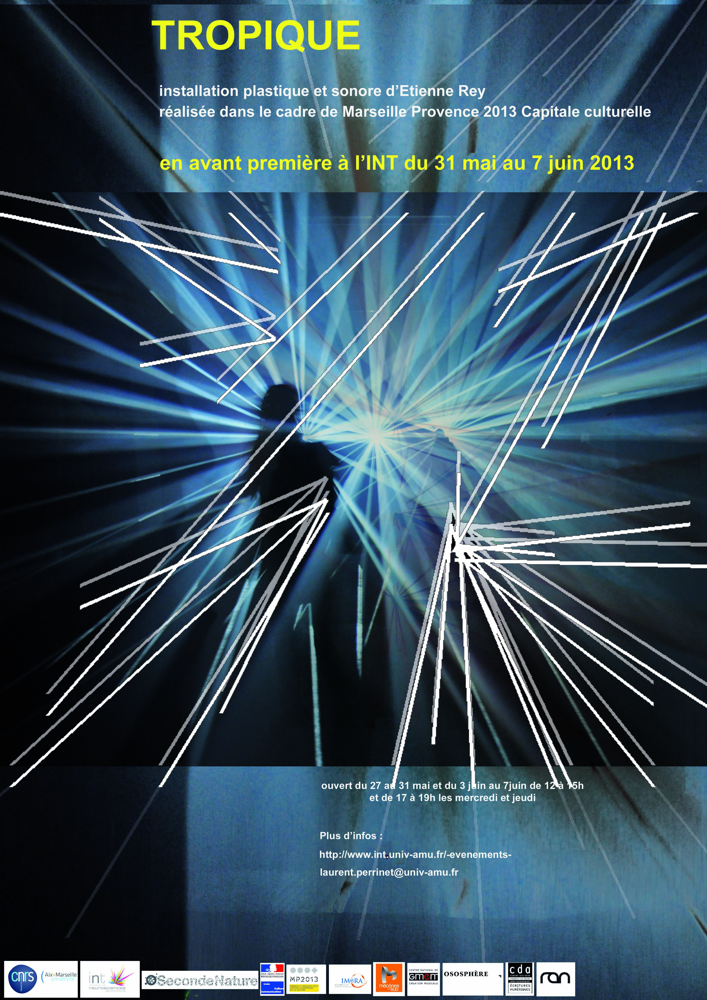

--- 
authors:
- etienne-rey
- laurent-u-perrinet
date: 2016-04-20 00:00:00
draft: false
lastmod: 2018-01-13 00:00:00
subtitle: Sculpture immersive.
summary: Tropique is an immersive installation which puts in link the perception of
  the space connected to the movement, to the light and to the sound.
title: TROPIQUE
tags:
- art-science
- visual-illusions
categories:
- Education
projects:
- art-science
---

# TROPIQUE

* « Tropique » est une installation artistique créée par Etienne Rey en collaboration avec Wilfried Wendling (son) et sous mon expertise scientifique. Elle a été produite pour l’Année européenne de la culture d’Aix-Marseille et présentée en 2013 à la fondation Vasarely. Cette installation immersive consiste en une sculpture de lumière incluse dans un espace fermé de 20 mètres de longueur sur 15 mètres de large. La salle est remplie de minuscules billes d’eau transparentes en suspension. Elles produisent une diffraction visible lorsqu’elles sont illuminées par les vidéoprojecteurs qui sont placés aux bords opposés de la salle. Les sources de lumière projettent des segments qui composent l’alphabet de la sculpture. Chaque segment est caractérisé par sa position, sa longueur et son orientation et chacun crée une lame de lumière dans l’espace de la salle. Une fois les segments combinés, ils forment un monde propre à la sculpture et isolé du monde habituel (voir aussi [cet article](https://laurentperrinet.github.io/2023-01-31_formes-et-perception/#fig:Tropique)). La grammaire qui régit les mouvements de ces segments est inspirée par les forces d’attraction et de répulsion observées aux tailles microscopiques des cellules et macroscopique des galaxies. Cette population de segments évoluait alors comme un système autonome, sans scénario pré-écrit ou enregistré et complété par une synchronisation des différentes sources de lumière ainsi que du système de génération spatiale du son. Un point crucial de l’installation était d’introduire une interaction intime entre ce système et chaque observateur. Un discret système de capteurs de mouvement permettait de localiser la présence des différents observateurs et de modifier la configuration de la sculpture en fonction de leurs mouvements. Le système évoluait ainsi de façon autonome d’une sculpture de lumière que l’on pouvait regarder et toucher à une configuration dans laquelle le spectateur était plongé dans un monde propre, intime. Dans cet état, les segments alignés autour de l’observateur formaient une “aura” où tout repère de perspective était perdu. Ce dispositif, en manipulant visible et invisible, levait alors le voile sur des mécanismes cachés de la perception



 * https://github.com/NaturalPatterns/Tropique

 

 

''Etienne Rey investigates the invisible and mutual relationships which take place between human and his environment. [Prize-winner of the 1st call for projects of the RAN](http://digitalperformanceculture.blog.fr/2012/02/18/tropique-d-etienne-rey-12817804/), its project of immersive installation Tropique puts in link the perception of the space connected to the movement, to the light and to the sound. Within the framework of a residence of creation in the Centre des arts, the object of which is ” to sculpt the light “, he presents a work in progress of this installation.''

[Tropique](http://ondesparalleles.org/projets/tropique-7/) est une installation environnementale, un espace vide de matière, qui se densifie en ondes sonores et lumineuses, activées et modulées par la présence et l’activité humaines. Ce projet met en lien la perception de l’espace articulée au mouvement, à la lumière et au son. Les personnes qui se situent dans l’espace sont entourées d’une aura lumineuse et sonore qui fluctue en fonction des mouvements et de la proximité des corps.

Etienne Rey investigates the invisible and mutual relationships which take place between human and his environment. Prize-winner of the 1st call for projects of the RAN, its project of immersive installation Tropique puts in link the perception of the space connected to the movement, to the light and to the sound. Within the framework of a residence of creation in the Centre des arts, the object of which is ” to sculpt the light “, he presents a work in progress of this installation.''



 "Tropique plonge le visiteur au coeur d’un espace embrumé, sculpté par la lumière et le son. Expérience sensorielle, le monde de Tropique évolue dans un entre-deux, rendant palpables des matérialités d’ordinaires invisibles. Expérience perceptive, le dispositif irradie l’espace, l’incorpore, l’amalgame, le dilate. La lumière se diffuse jusqu’à modifier notre rapport à l’espace, elle le redessine à travers notre propre vision et provoque une expérience personnelle, une émotion visuelle. L’environnement réagit aux variations de l’activité dans l’installation, à la façon dont nous l’habitons et le transformons. Tropique contruit un espace dynamique une architecture mobile à l’état de l’air, en miroir à notre présence. Ce qui est révélé est un ensemble vivant, la plupart du temps imperceptible, comme une mise une lumière de notre écosystème et de ses interrelations. Ce projet est élaboré avec le concours d’une équipe pluridisciplinaire composée d’un chercheur en Neuroscience : Laurent Perrinet, d’un compositeur : Wilfried Wendling d’un ingénieur : Julien Marro Dauzat."

Accueilli en résidence dans le cadre des résidences de recherche de l’IMéRA pendant 6 mois (3 périodes de 2 mois),et soutenu dans le cadre d'un Atelier de l'!EuroMéditerranée, ce projet est élaboré en collaboration avec des chercheurs. Nous abordons ainsi les questions de la cognition et de la perception de l’espace liées à la vue, à l’audition, et au déplacement, auxquelles nous lierons les questions relatives à la diffusion de phénomènes ondulatoires.

## news


 - [space odyssée](http://ondesparalleles.org/projets/space-odyssey/) à [l'institut francais en Coree du Sud de juin a octobre 2016](http://www.institutfrancais-seoul.com/portfolio-item/exposition-home-cinema/)
 - Un entretien d'ER durant le [Mois multi 2015](https://www.youtube.com/watch?v=lA2bovigzLg)



 - Installation [Space Odyssey](http://ondesparalleles.org/projets/space-odyssey/) : Tournée en Corée avec Mac de Créteil en 2016 / dates et lieux à venir.
 - Installation [Space Odyssey](http://ondesparalleles.org/projets/space-odyssey/) : FESTIVAL VIA / MAUBEUGE / 12 AU 22 MARS 2015 - FESTIVAL EXIT / CRÉTEIL / 26 MARS AU 05 AVRIL 2015 - LE PRINTEMPS À SAINT SAUVEUR / LILLE / 27 AVRIL 2016 AU 28 AOÛT 2016 : [Home Cinema](http://www.maccreteil.com/fr/mac/event/338/Home-cinema-Festival-Exit#sthash.bEyRuaDX.dpuf). À lire, sur [digitatarti](http://www.digitalarti.com/fr/blog/digitalarti_mag/home_cinema_matiere_audiovisuelle_modulable_pour_hyper_spectateur).
Installation [Tropique](http://ondesparalleles.org/projets/tropique-7/) : Festival international d’arts multidisciplinaires et électroniques [Le Mois Multi 16 / Québec du 4 février au 1 mars 2015](http://mmrectoverso.org/fr/mois-multi/spectacles/installations-2/tropique/)



 - Installation [Space Odyssey](http://ondesparalleles.org/projets/space-odyssey/) : Lille 3000, du 26 SEPT 2015 > 17 JAN 2016
 - Installation [Space Odyssey](http://ondesparalleles.org/projets/space-odyssey/) : FESTIVAL INTERNATIONAL EXIT 2015 Créteil du 26 MARS -> 05 AVRIL 2015
 - Installation [Space Odyssey](http://ondesparalleles.org/projets/space-odyssey/) : Festival Via 2015, Maubeuge du jeudi 12 mars 2015 au dimanche 22 mars 2015
 - Du 13 au 23 Mars 2014: [TROPIQUE @ FESTIVAL VIA](http://www.lemanege.com/cgi?lg=fr&pag=1310&tab=108&rec=1188&frm=0) : Depuis presque 30 ans, le Festival VIA flirte avec les frontières des territoires artistiques, à la croisée des arts de la scène, de la création technologique et numérique. Toujours plus international et interdisciplinaire, VIA traduit, à Maubeuge et à Mons, la vitalité de la scène contemporaine. Il est également à noter que cette édition préfigure la Capitale européenne de la culture 2015 qui se déroulera dans ces deux villes l'année prochaine.  Pour cette nouvelle édition de VIA sera présentée l'installation Tropique d'Etienne Rey, produite par Seconde Nature et récemment dévoilée lors du festival « Chroniques des Mondes Possibles » dans le cadre d'E-topie, Marseille-Provence 2013.
 - 16 novembre au 15 décembre 2013: présentation à Paris dans le cadre du festival [nemo](http://www.digitalarti.com/fr/blog/digitalarti_mag/festival_nemo_tropiques_etienne_rey) ; écouter [la tête au carré sur France Inter](http://www.franceinter.fr/emission-latac-faux-sourires-vision-cosmique-installation-tropique)
 - 10 Octobre au 10 novembre 2013: présentation finale à la fondation Vasarely à Aix-en-Provence dans le cadre du festival [e-Topie](http://www.fondationvasarely.org/uk/e_topie.php), cf [cahier beaux-arts de libé](http://www.liberation.fr/culture/2013/10/15/riche-e-topie-a-aix_939736), [la provence](http://www.laprovence.com/article/economie/2628580/aix-la-ville-candidate-pour-devenir-quartier-numerique.html)  : 10450 spectateurs sur 32 jours
 -  Juin 2013: [résidence à l'INT](https://laurentperrinet.github.io/post/2013-10-10_tropique/featured.jpg)
 - Décembre 2012: dans le [programme officiel](http://www.mp2013.fr/evenements/2013/10/atelier-de-leuromediterranee-tropique-etienne-rey-a-limera/)
 - Décembre 2012: signature de la convention avec le CNRS
 - Tropique est présenté [07 au 14 décembre 2012, dans le cadre du festival "Les nuits de l’Ososphère" de Strasbourg](http://www.ososphere.org/2012/evenement/tropique/)
 - Juin 2012: Tropique en résidence à la fondation Vasarely
 - Mars 2012: [Tropique à Nantes](http://www.mecenesdusud.fr/blog/index.php?post/2012/03/Tropique-%C3%A0-Nantes)
 - [Arte creative](http://creative.arte.tv/en/space/Tropique/messages/)
 - Tropique @ [RAN (Enghien-les-Bains)](http://www.ran-dan.net/eng/?p=22)
 - [Etienne Rey Tropique Experimentation Film2](http://vimeo.com/33718945)
