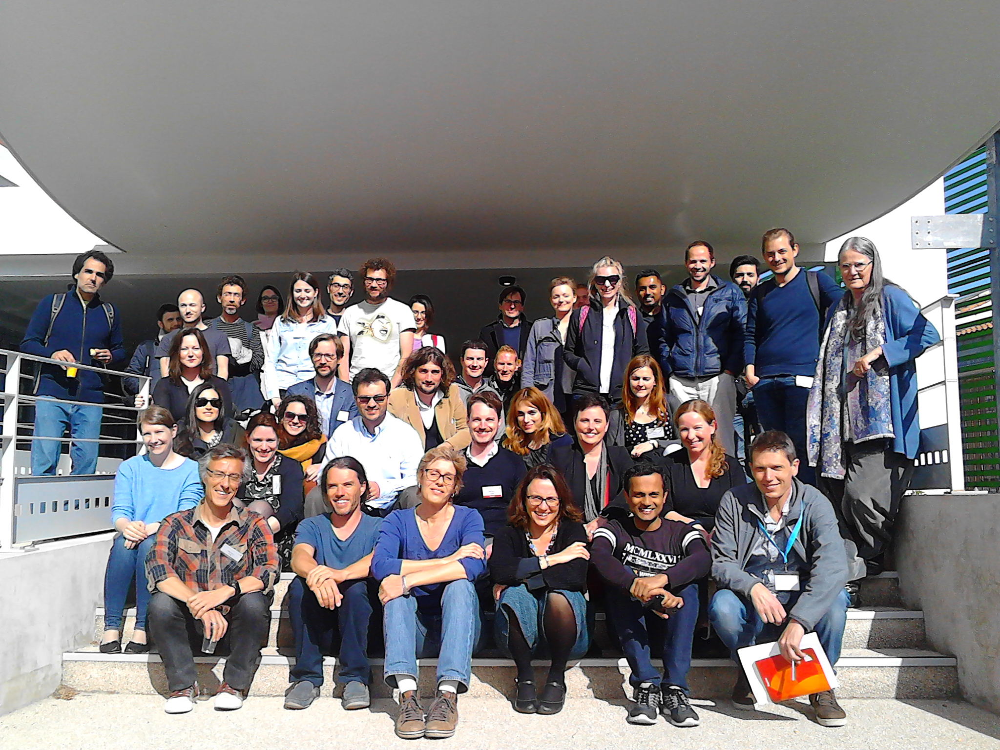

---
authors:
- laurent-u-perrinet
date: 2018-04-05 00:00:00
draft: false
featured: false
image:
  caption: ''
  focal_point: Smart
summary: 'We organize a Symposium at NeuroFrance 2019 entitled Active Inference: Bridging
  theoretical and experimental neurosciences. This is part of a series of theoretical
  neuroscience symposia organized in this international conference from the french
  Neursocience Society.'
title: '2018-04-05 : *Probabilities and Optimal Inference to understand the Brain*
  Workshop'
tags: ["bayesian-modelling", "probalistic-inference"]
categories: ["Behavioural Neuroscience", "NeuroAI & Machine Learning", "Theoretical Neuroscience"]
projects: [""]
---

# Probabilities and Optimal Inference to understand the Brain
## a 2-day workshop at the Institute of Neurosciences Timone in Marseille

Date
:   April 5-6th 2018

Location

:   [Institute of Neurosciences Timone in Marseille in the south of
    France](http://www.int.univ-amu.fr/contact)

Main site

:   <https://opt-infer-brain.sciencesconf.org/>

Full program

:   <https://opt-infer-brain.sciencesconf.org/program/details>.

Organizing committee
:   Paul Apicella, Frederic Danion, Nicole Malfait, Anna Montagnini and
    Laurent Perrinet

