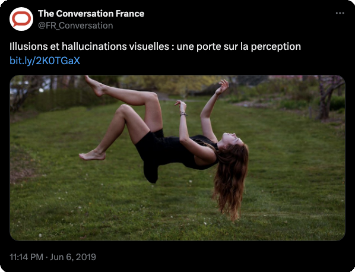
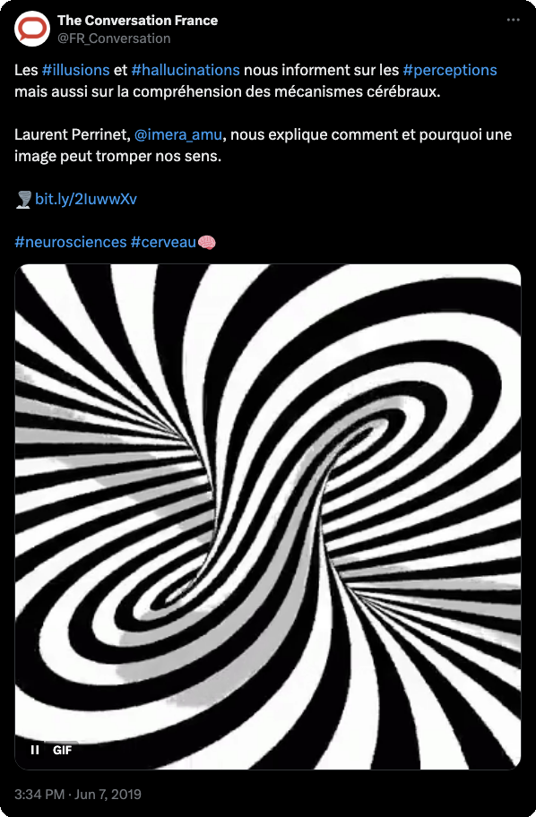

---
authors:
- laurent-u-perrinet
date: 2019-06-13 00:00:00
draft: false
featured: false
image:
  caption: Hallucination ? Ashley Bean/Unsplash
  focal_point: Center
projects:
- tout-public
- art-science
summary: Article de dissémination sur la perception visuelle vue à travers illusions et hallucinations.
tags:
- neuroscience
- vision
- psychiatry
title: 'Illusions et hallucinations visuelles : une porte sur la perception'
---

Publication d'un nouvel article généraliste autour des "Illusions et hallucinations visuelles" à découvrir sur le site [TheConversation](https://theconversation.com/illusions-et-hallucinations-visuelles-une-porte-sur-la-perception-117389):

Les objectifs sont :

* mieux comprendre la fonction de la perception visuelle en explorant certaines limites ;
* mieux comprendre l’importance de l’aspect dynamique de la perception ;
* mieux comprendre le rôle de l’action dans la perception.

Une version étendue est accessible sur le [repo GitHub](https://laurentperrinet.github.io/2019-05_illusions-visuelles/), ainsi que les [sources](https://github.com/laurentperrinet/2019-05_illusions-visuelles).
