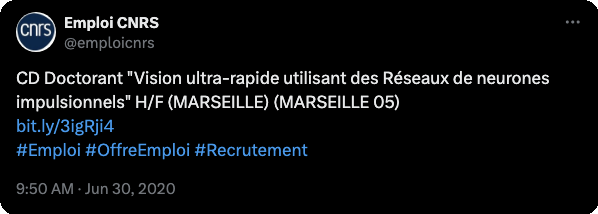

{}
THE POSITION HAS BEEN FILLED.
{}

Dear colleagues,

Applications are welcome for a fully funded doctoral position at [INT](http://www.int.univ-amu.fr/?lang=en) in [Marseille](https://en.wikipedia.org/wiki/Marseille), France. Your mission will be to build ultra-fast vision algorithms using event-based cameras and spiking neural networks. The project is funded by the [APROVIS3D](https://laurentperrinet.github.io/grant/aprovis-3-d/) grant (ANR-19-CHR3-0008-03) and will be coordinated by [Laurent Perrinet](https://laurentperrinet.github.io/). The work will be carried out in collaboration with a leading computer science institute at Université Côte d’Azur (Sophia Antipolis, France), the Laboratoire d'Informatique, Signaux et Systèmes de Sophia-Antipolis (I3S, UMR7271 - UNS CNRS), that will be part of the supervision team. We are seeking candidates with a strong background in machine learning, computer vision and computational neuroscience.

To obtain further information, please visit [https://laurentperrinet.github.io/post/2020-06-30_phd-position](https://laurentperrinet.github.io/post/2020-06-30_phd-position) or contact me @ [Laurent.Perrinet@univ-amu.fr](mailto:Laurent.Perrinet@univ-amu.fr). To candidate, follow instructions on the dedicated [server from the CNRS](https://bit.ly/3igRji4).

The starting date is set to October 1st, 2020 and the appointment is for 36 months. Applications are welcome immediately.

Thanks for distributing this announcement to potential candidates!

## Detailed description: "Ultra-fast vision using Spiking Neural Networks"

Biological vision is surprisingly efficient. To take advantage of this efficiency, Deep learning and convolutional neural networks (CNNs) have recently produced great advances in artificial computer vision. However, these algorithms now face multiple challenges: learned architectures are often not interpretable, disproportionally energy greedy, and often lack the integration of contextual information that seems optimized in biological vision and human perception. Crucially, given an equal constraint on energy consumption, these algorithms are relatively slow compared to biological vision. It is believed that one major factor of this rapidity is the fact that visual information is represented by short pulses (spikes) at analog – not discrete – times ([Paugam and Bohte, 2012](#Paugam12)). However, most classical computer vision algorithms rely on such frame-based approaches. One solution to overcome their limitations is to use event-based representations, but these still lack in practice, and their high potential is largely underexploited. Inspired by biology, the project addresses the scientific question of developing a low-power sensing architecture for the processing of visual scenes, able to function on analog devices without a central clock and aimed at being validated in real-life situations. More specifically, the project will develop new paradigms for biologically inspired computer vision ([Cristobal, Keil and Perrinet, 2015](#Cristobal15)), from sensing to processing, in order to help machines such as Unmanned Autonomous Vehicles (UAV), autonomous vehicles, or robots gain high-level understanding from visual scenes.

**In this doctoral project, we propose to address major limitations of classical computer vision by implementing specific dynamical features of cortical circuits: _spiking neural networks_ ([Perrinet, Thorpe and Samuelides, 2004](#Perrinet04); [Lagorce et al., 2018](#Lagorce16)), _lateral diffusion of neural information_ ([Chavane et al., 2011](#Chavane2000); [Muller et al., 2018](#muller2018cortical)) and _dynamic neuronal association fields_ ([Frégnac et al., 2012](#Frégnac2012); [Frégnac et al., 2016](#Frégnac2016); [Gerard-Mercier et al., 2016](#gerard2016synaptic))**. One starting point is to use event-based cameras [(Dupeyroux et al., 2018)](#Dupeyroux18) and to extend results of self-supervised learning that we have obtained on static, natural images ([Boutin et al., 2020](#BoutinFranciosiniChavaneRuffierPerrinet20)) showing in a recurrent cortical-like artificial CNN architecture the emergence of interactions which phenomenologically correspond to the "association field" described at the psychophysical ([Field et al., 1993](#Field1993)), spiking ([Li and Gilbert, 2002](#Li2002)) and synaptic ([Gerard-Mercier et al., 2016](#gerard2016synaptic)) levels. Indeed, the architecture of primary visual cortex (V1), the direct target of the feedforward visual flow, contains dense local recurrent connectivity with sparse long-range connections ([Voges and Perrinet, 2012](#Voges12)). Such connections add to the traditional convolutional kernels representing feedforward and local recurrent amplification a novel lateral interaction kernel within a single layer (across positions and channels). It is not well understood, but probably decisive for ultra-fast vision, how recurrent cortico-cortical loops add a level of distributed top-down complexity in the feed-forward stream of information which participates to the ultra-fast integration of sensory input and perceptual context ([Keller et al., 2019](#Keller2019)). Coupled with the dynamics of cortical circuits, this elaborate multiplexed architecture provides the conditions possible for defining ultra-fast vision algorithms.

## Expected profile of the candidate
Candidates should have experience in the domain of computational neuroscience, physics, engineering or related, and a solid training in machine learning and computer vision.

The candidate has to show good skills in computer science (programming skills, architecture understanding, git versioning, ...), and in image processing methods. Good command of programming tools (Python scripting) is required. Multidisciplinary background would be strongly appreciated and in particular an advanced knowledge in mathematics, for a deep understanding of signal processing methods, along with strong computational skills. The candidate needs to show a keen interest in neuroscience. It is a bonus if the candidate is curious about neuroscience and visual perception.

The candidate has to fluently speak English to understand publications and to attend international conferences and workshops and pro-actively interact with partners in France, Switzerland, Spain and Greece. The preferred candidate will have the ability to work autonomously, and needs to be flexible to comply with the working method of the supervisors.

## Research context

The thesis will be carried out in the team "NEuronal OPerations in visual TOpographic maps" (NeOpTo) within the [Institut de Neurosciences de la Timone](http://www.int.univ-amu.fr/?lang=en) in [Marseille](https://en.wikipedia.org/wiki/Marseille), a welcoming and lively town by the Mediterranean sea in the south of France. The research team is led by F. Chavane (DR2, CNRS) and currently hosts 4 permanent staff, 3 post-docs and 4 PhD students. The research themes of the team are focused on neuronal operations within visual cortical maps. Indeed, along the cortical hierarchy, low-level features such as the position and orientation of the visual stimulus (but also auditory tone, somatosensory touch, etc...) but also higher-level features (such as faces, viewpoints of objects, etc...) are represented topographically on the cortical surface.

This work will be conducted in direct collaboration with [Jean Martinet](http://i3s.unice.fr/jmartinet/en) who will co-supervise the thesis. We will develop these algorithms in collaboration with [Ryad Benosman](https://scholar.google.fr/citations?user=_ZTFUooAAAAJ&hl=fr) (Université Pierre et Marie Curie) and [Stéphane Viollet](https://scholar.google.com/citations?user=iIGoymcAAAAJ) (équipe biorobotique, Institut des Sciences du Mouvement).

## FR: Description du sujet de thèse
La vision biologique est étonnamment efficace. Pour tirer parti de cette efficacité, l'apprentissage profond et les réseaux neuronaux convolutionnels (CNN) ont récemment permis de réaliser de grandes avancées en matière de vision artificielle par ordinateur. Cependant, ces algorithmes sont aujourd'hui confrontés à de multiples défis : les architectures apprises sont souvent peu interprétables, sont démesurément gourmandes en énergie, n'intègrent généralement pas les informations contextuelles qui semblent parfaitement adaptées à la vision biologique et à la perception humaine. Aussi ces algorithmes sont relativement lents -à consommation énergétique égale- par rapport à la vision biologique. On pense qu'un facteur majeur de cette rapidité est le fait que l'information est représentée par de courtes impulsions à des moments analogiques - et non discrets. Toutefois, les algorithmes de vision par ordinateur utilisant une telle représentation dans des réseaux de neurones impulsionnels font encore défaut dans la pratique, et son important potentiel est largement sous-exploité. Ce projet, qui est inspiré de la biologie, aborde la question scientifique du développement d'une architecture ultra-rapide de détection et de traitement de scènes visuelles, fonctionnant sur des appareils sans horloge centrale, et visant à valider ce genre d'algorithmes événementiels dans des situations réelles. Plus spécifiquement, le projet développera de nouveaux paradigmes pour une vision d'inspiration biologique, de la détection au traitement, afin d'aider des machines telles que les robots aériens autonomes (UAV), les véhicules autonomes ou les robots à acquérir une compréhension de haut niveau des scènes visuelles.

## FR: Contexte de travail
La thèse sera effectuée dans l'équipe "NEuronal OPerations in visual TOpographic maps" (NeOpTo) au sein de l'Institut de Neurosciences de la Timone (INT). L'équipe de recherche est dirigée par F. Chavane (DR2, CNRS) et accueille actuellement 4 personnels permanents, 3 post-doctorants et 4 doctorants. Les thématiques de recherche de l'équipe sont centrées sur les opérations neuronales au sein de cartes corticales visuelles. En effet, le long de la hiérarchie corticale, les caractéristiques de bas niveau telles que la position, l’orientation du stimulus visuel (mais aussi la tonalité auditive, le toucher somatosensoriel, etc...) mais aussi les caractéristiques de niveau supérieur (telles que les visages, les points de vue d’objets, etc...) sont représentées topographiquement sur la surface corticale.

Cette thèse sera menée en collaboration directe avec [Jean Martinet](http://i3s.unice.fr/jmartinet/en) qui co-supervisera cette thèse. Nous développerons ces algorithmes en collaboration avec [Ryad Benosman](https://scholar.google.fr/citations?user=_ZTFUooAAAAJ&hl=fr) (Université Pierre et Marie Curie) et [Stéphane Viollet](https://scholar.google.com/citations?user=iIGoymcAAAAJ) (équipe biorobotique, Institut des Sciences du Mouvement).

# References

* <a name="BoutinFranciosiniChavaneRuffierPerrinet20">Boutin, Victor, Angelo Franciosini, Frédéric Chavane, Franck Ruffier, and Laurent U Perrinet. (2019). </a> "[Sparse Deep Predictive Coding captures contour integration capabilities of the early visual system.](https://arxiv.org/abs/1902.07651)" *arXiv*

* <a name="Dupeyroux18">Julien Dupeyroux, Victor Boutin, Julien R Serres, Laurent U Perrinet, Stéphane Viollet. (2018). </a> "[M2APix: a bio-inspired auto-adaptive visual sensor for robust ground height estimation.](https://laurentperrinet.github.io/publication/dupeyroux-boutin-serres-perrinet-viollet-18/)" *ISCAS*

* <a name="Chavane2011">Chavane, F., Sharon, D., Jancke, D., Marre, O., Frégnac, Y. and Grinvald, A. (2011). </a> "[Lateral spread of orientation selectivity in V1 is controlled by intracortical cooperativity.](https://doi.org/10.1016/S0928-4257(00)01096-2)" *Journal of Physiology Paris* 94 (5-6): 333--42.

* <a name="Cristobal15">Gabriel Cristóbal, Laurent U Perrinet, Matthias S Keil (2015). </a> "[Biologically Inspired Computer Vision.](https://laurentperrinet.github.io/publication/cristobal-perrinet-keil-15-bicv/)" *Wiley*.

* <a name="Field1993">Field, D.J., Hayes, A. and Hess, R.F. (1993). </a> "[Contour integration by the human visual system: Evidence for a local “association field”.](https://doi.org/10.1016/0042-6989(93)90156-Q)" *Vision Research* 33 (2), pp. 173-193.
* <a name="gerard2016synaptic">Gerard-Mercier, Florian, Pedro V Carelli, Marc Pananceau, Xoana G Troncoso, and Yves Frégnac. (2016). </a> "[Synaptic Correlates of Low-Level Perception in V1.](https://www.jneurosci.org/content/36/14/3925)" *Journal of Neuroscience* 36 (14): 3925--42.

* <a name="Keller2019">Keller, A., Roth, M.M. and Scanziani, M. (2019). </a> 2019. "[The feedback receptive field of neurons in the mammalian primary visual cortex.](https://www.abstractsonline.com/pp8/#!/7883/presentation/65856)" *American Society for Neuroscience Abstracts*, 403.13. Chicago.

* <a name="Lagorce16">Lagorce, X., Orchard, G., Galluppi, F., Shi, B. E., & Benosman, R. B.</a> (2016). "[HOTS: a hierarchy of event-based time-surfaces for pattern recognition.](https://www.neuromorphic-vision.com/public/publications/1/publication.pdf)" *IEEE transactions on pattern analysis and machine intelligence*.

* <a name="Li2002">Li W, Piëch V, Gilbert CD</a> (2006). "[Contour saliency in primary visual cortex.](http://www.paper.edu.cn/scholar/showpdf/MUz2UN2INTA0eQxeQh)" *Neuron*, 50(6):951–962.

* <a name="muller2018cortical">Muller, Lyle, Frédéric Chavane, John Reynolds, and Terrence J Sejnowski. </a> (2018). "[Cortical Travelling Waves: Mechanisms and Computational Principles.](https://papers.cnl.salk.edu/PDFs/Cortical%20travelling%20waves_%20mechanisms%20and%20computational%20principles.%202018-4515.pdf)" *Nature Reviews Neuroscience* 19 (5): 255.

* <a name="Paugam12">Hélène Paugam-Moisy, Sander M. Bohte. </a> (2012). "Computing with Spiking Neuron Networks." *Handbook of Natural Computing*, Springer-Verlag, pp.335-376, 2012

* <a name="Perrinet04">Laurent U Perrinet, Manuel Samuelides, Simon J Thorpe. </a> (2004). ["Coding static natural images using spiking event times: do neurons cooperate?"](https://laurentperrinet.github.io/publication/perrinet-03-ieee/) *IEEE Transactions on Neural Networks*.

* <a name="Tang18">Tang, Hanlin, Martin Schrimpf, William Lotter, Charlotte Moerman, Ana Paredes, Josue Ortega Caro, Walter Hardesty, David Cox, and Gabriel Kreiman. </a> (2018). "[Recurrent computations for visual pattern completion.](https://doi.org/10.1073/pnas.1719397115)" *Proceedings of the National Academy of Sciences* 115 (35) 8835-8840.

* <a name="Voges12">Voges, Nicole, and Laurent U Perrinet.</a> (2012). "[Complex Dynamics in Recurrent Cortical Networks Based on Spatially Realistic Connectivities.](https://doi.org/10.3389/fncom.2012.00041)" *Frontiers in Computational Neuroscience* 6.
