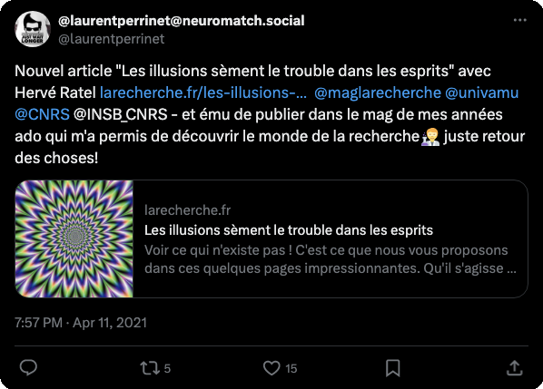

---
authors:
- laurent-u-perrinet
date: 2021-04-06 00:00:00
draft: false
featured: true
projects:
- tout-public
tags: ["neuroscience", "psychiatry", "vision"]
title: 'Les illusions sèment le trouble dans les esprits'
summary: "Article de dissémination : la perception visuelle, telle qu'elle paut être comprise à travers illusions visuelles."
links:
- name: URL
  url: https://laurentperrinet.github.io/2019-05_illusions-visuelles/
categories: ["Events & Outreach"]
---
Publication d'un nouvel article généraliste autour des illusions visuelles, "*Les illusions sèment le trouble dans les esprits*" à découvrir dans lee dossier [La Recherche n°565](https://www.larecherche.fr/les-illusions-s%C3%A8ment-le-trouble-dans-les-esprits) (trimestriel N°565 daté avril-juin 2021):

Les objectifs sont :

* mieux comprendre la fonction de la perception visuelle en explorant certaines limites;
* mieux comprendre l’importance de l’aspect dynamique de la perception;
* mieux comprendre le rôle de l’action dans la perception.

Une version précédente est accessible sur le [repo GitHub](https://laurentperrinet.github.io/2019-05_illusions-visuelles/), ainsi que les [sources](https://github.com/laurentperrinet/2019-05_illusions-visuelles).

