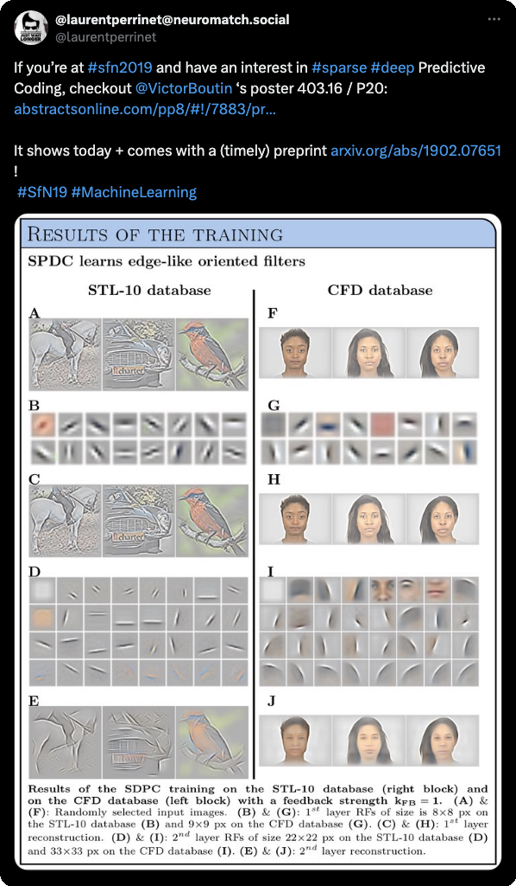

---
authors:
- Victor Boutin
- Angelo Franciosini
- Frédéric Y Chavane
- Franck Ruffier
- Laurent U Perrinet
date: 2019-01-01
featured: false
projects:
- doc-2-amu
- phd-icn
- mesocentre
links:
- name: URL
  url: https://laurentperrinet.github.io/publication/boutin-franciosini-ruffier-perrinet-19-sfn/

publication: '*Proceedings of the Society for Neuroscience conference*'
publication_types:
- inproceedings
tags: ["predictive-coding", "sparse-coding"]
title: Sparse Deep Predictive Coding to model visual object recognition
categories: ["Computational Neuroscience", "NeuroAI & Machine Learning"]
---

* see a follow-up in: 
* more about the role of top-down connections: 
