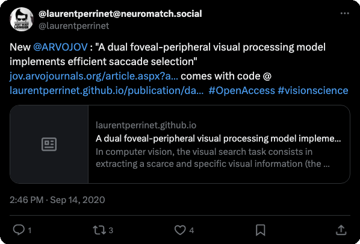

--- 
abstract: In computer vision, the visual search task consists in extracting a scarce
  and specific visual information (the target) from a large and crowded visual display.
  This task is usually implemented by scanning the different possible target identities
  at all possible spatial positions, hence with strong computational load. The human
  visual system employs a different strategy, combining a foveated sensor with the
  capacity to rapidly move the center of fixation using saccades. Saccade-based visual
  exploration can be idealized as an inference process, assuming that the target position
  and category are independently drawn from a common generative process. Knowing that
  process, visual processing is then separated in two specialized pathways, the where
  pathway mainly conveying information about target position in peripheral space,
  and the what pathway mainly conveying information about the category of the target.
  We consider here a dual neural network architecture learning independently where
  to look and then at what to see. This allows in particular to infer target position
  in retinotopic coordinates, independently to its category. This framework was tested
  on a simple task of finding digits in a large, cluttered image. Simulation results
  demonstrate the benefit of specifically learning where to look before actually knowing
  the target category. The approach is also energy-efficient as it includes the strong
  compression rate performed at the sensor level, by retina and V1 encoding, which
  is preserved up to the action selection level, highlighting the advantages of bio-mimetic
  strategies with regards to traditional computer vision when computing resources
  are at stake.
authors:
- Emmanuel Daucé
- Pierre Albigès
- Laurent U Perrinet
date: 2020-06-05
doi: 10.1167/jov.20.8.22
featured: false
grants:
- spikeai
- mesocentre
- aprovis-3-d
links:
- name: Pdf
  url: https://doi.org/10.1101/725879
- name: Code
  url: https://github.com/laurentperrinet/WhereIsMyMNIST
- name: URL
  url: https://laurentperrinet.github.io/publication/dauce-20/
- name: bioRxiv
  url: https://www.biorxiv.org/content/10.1101/725879
publication: '*Journal of Vision*'
publication_types:
- article-journal
title: A dual foveal-peripheral visual processing model implements efficient saccade
  selection
tags:
- bayesian-modelling
- eye-movements
- foveated-vision
- log-polar-mapping
- neuro-inspired-computing
- neuroAI
- primary-visual-cortex
- retinotopy
- saccades
- visual-search
categories:
- Behavioural Neuroscience
- Biological Neuroscience
- Computational Neuroscience
- Computer Vision
- Education
- NeuroAI & Machine Learning
- Theoretical Neuroscience
- Visual Neuroscience
projects: []
---


* for a more mathematical treatment, see 

