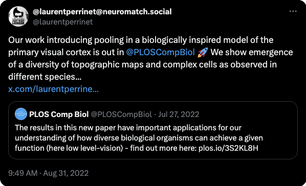
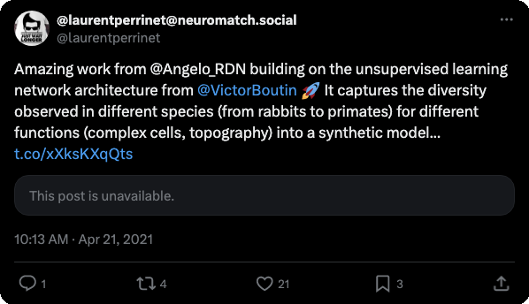

* this paper follows this COSYNE presentation : 

* see a related work describing SDPC in: 

* more about the role of top-down connections: 

<iframe src="https://www.facebook.com/plugins/post.php?href=https%3A%2F%2Fwww.facebook.com%2Fyann.lecun%2Fposts%2F10157650553112143&width=500&show_text=true&height=305&appId" width="500" height="305" style="border:none;overflow:hidden" scrolling="no" frameborder="0" allowfullscreen="true" allow="autoplay; clipboard-write; encrypted-media; picture-in-picture; web-share"></iframe>

