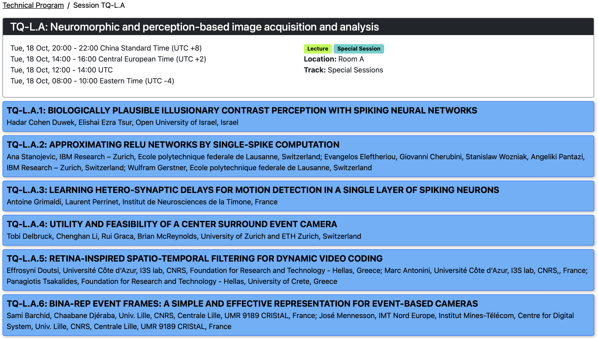

* see a follow-up as journal paper: 
* presented at [ICIP 2022](https://2022.ieeeicip.org) 16-19 October 2022 in Bordeaux, France
* paper [3241](https://cmsworkshops.com/ICIP2022/papers/accepted_papers.php) (note that the title of the paper was slightly changed)
* time of presentation:
 * Tue, 18 Oct, 20:30 - 20:45 China Standard Time (UTC +8)
 * Tue, 18 Oct, 14:30 - 14:45 Central European Time (UTC +2)
 * Tue, 18 Oct, 12:30 - 12:45 UTC
 * Tue, 18 Oct, 08:30 - 08:45 Eastern Time (UTC -4)
## Session "Neuromorphic and perception-based image acquisition and analysis"
* [TQ-L.A Special session on Tueasday, October 18 from 14:00 to 16:00](https://cmsworkshops.com/ICIP2022/view_session.php?SessionID=1009)

* Organized by Dr. Marc Antonini, Dr. Panagiotis Tsakalides, and Dr. Effrosyni Doutsi:
> During the last decade much attention has been paid to understanding the human brain properties and functions in order to mimic the computational mechanisms of this highly intelligent processing “machine” that seems to be able to address several technological challenges that the scientific community is currently facing. Digital sobriety is quite important among these challenges as it concerns the reduction of the energy footprint caused by the use and transmission of the digital information. According to recent studies, almost 80% of global data flows is due to online videos stored in big data centers ready to be accessed on demand at any time by several users all over the world. As a result, scientists are urged to find energy-saving solutions to capture, process, understand, compress and stream this great volume of visual information in an environmental responsible and greener manner.
> *Brain-inspired or neuro-inspired or spike-based or event-based computing are all terms used to describe the emerging technological trend motivated by the brain capability to dynamically capture and to spatio-temporally process and transform the great volume of the 3D visual information into a very compact spike train that is fed forward to the visual cortex of the brain passing through a very dense neural network. This is an energy efficient process, a fact that triggered the attention of the signal processing community trying to design more sober video services.*
> Indeed, every step of the brain processing pipeline provides inspiration towards novel disruptive implementations of image and video processing components: (i) visual sensors responsible for capturing and projecting the visual information into a neuromorphic chip, (ii) image understanding utilizing spiking neural networks to better approximate the dense interconnected network of neurons along the visual pathway, (iii) image processing and compression motivated by the exceptional compactness of the spike trains, capable of providing an ultra-high-definition perception of the visual world. In addition, the last decade has witnessed the progress of neuromorphic algorithms and hardware, which has already reached performance and manufacturing levels that is beyond the state- of-the-art.
> The objective of this special session is to highlight the importance of neuromorphic computing in image and video processing. We are interested in bringing together scientists working on different spike-based computational models, from sensing to understanding, who will share their knowledge and discuss about the advantages and the limitations of this type of systems. The aim is to progress towards an end-to-end and robust technology where the hardware and software will both follow the same neuro-inspired principles, addressing important challenges of the current conventional systems. Last but not least, this special session would be a great opportunity to build a strong international consortium between different teams to attract European and international funding to further study and promote neuromorphic computing for different signal processing open challenges.
