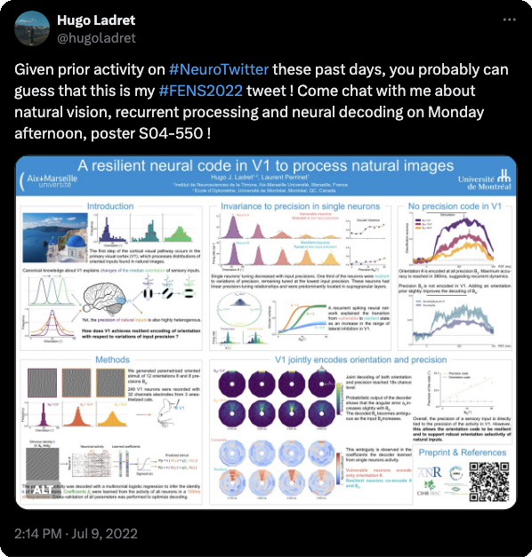

---
authors:
- Hugo Ladret
- Laurent U Perrinet
date: 2022-07-11
draft: false
featured: false
grants:
- anr-anr
image:
  caption: ''
  focal_point: Smart
  preview_only: false
lastmod: 2022-06-08 13:33:46+02:00
links:
- name: URL
  url: https://laurentperrinet.github.io/publication/ladret-22-fens/

publication: '*Proceedings of the FENS Forum 2022*'
publication_types:
- inproceedings
publishDate: '2022-06-16T11:51:41.890310Z'
subtitle: ''
title: Recurrent cortical connectivity in the primary visual cortex supports robust
  encoding of natural sensory inputs
tags:
- primary-visual-cortex
categories:
- Computational Neuroscience
- Visual Neuroscience
projects:
- ''
---

* This poster is presented in the following paper (published in Nature Comm Biology): 
