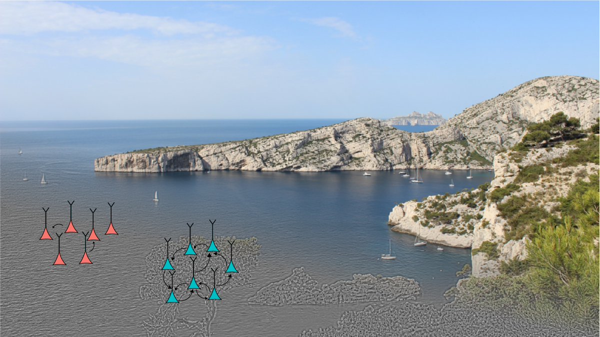

* open access: https://www.nature.com/articles/s42003-023-05042-3
* 5 minutes summary: https://hugoladret.github.io/publications/ladret_et_al_variance_v1/
* Code : https://github.com/hugoladret/variance-processing-V1
* Data : https://figshare.com/articles/dataset/Data_for_Ladret_et_al_2023_Cortical_recurrence_supports_resilience_to_sensory_variance_in_the_primary_visual_cortex_/23366588


* preprint of a former revision: https://www.biorxiv.org/content/10.1101/2021.03.30.437692v5
* This neurophysiological work accompanies a similar study in theoretical neuroscience : 
## Communiqué de presse: Comment le cerveau fait face à l'incertitude ?
**[Introduction :] Nous vivons dans un monde fait d'incertitudes, qui pourtant ne nous empêchepas d'effectuer nos tâches quotidiennes. Vous ne traverseriez pas la route avant d'être certain que le conducteur de la voiture passante vous a vu, pas d'avantage que vous ne vous approcheriez pas d'un buisson avant d'être sûr qu'il est occupé par un oiseau plutôt que par un lion. Malgré la nécessité fondamentale de résoudre ces incertitudes au quotidien, nous savons relativement peu sur la manière dont notre cerveau procède pour ce faire. Dans cet article publié dans *Nature Communications Biology*, les scientifiques présentent des enregistrements des neurones du cerveau, et mettent en évidence un nouveau type de neurone qui encode cette incertitude. Cette recherche est clé pour avancer la compréhension de notre cerveau et construire des modèles artificiels qui peuvent prendre en compte leurs certitudes.**
Imaginez que vous vous promeniez dans une forêt. Le vent bruisse dans les feuilles, quand soudain un bruit étrange attire votre attention. S'agit-il d'un écureuil qui se précipite sur le sentier à la vue de tous ? Ou peut-être d'un oiseau niché derrière les buissons, caché dans le feuillage ? Dans ce dernier cas, prenez-vous le temps de voir l'oiseau, ou en déduirez-vous que le bruissement est plutôt celui d'un lion, et vous enfuirez-vous le plus vite possible ?
Ce simple scénario illustre un problème quotidien auquel nous sommes confrontés : comment notre cerveau peut-il donner un sens au monde, alors que nos sens sont bombardés d'informations peu fiables ? Ce manque de précision - l'inverse de la variance d'une information - est marquant dans le domaine de la vision. En effet, une image peut être décomposée en de nombreuses lignes ou "bords" qui forment sa structure, à l'instar d'un puzzle composé de nombreuses pièces différentes.

Cependant, toutes les pièces du puzzle ne sont pas coupées de la même manière, et certaines ont des bords plus variables que d'autres. C'est un problème pour la toute première zone de notre cerveau qui commence à donner un sens à ces "pièces de puzzle" visuelles, le cortex visuel primaire. Jusqu'à récemment, notre compréhension de la manière dont le cerveau traite ces données visuelles complexes reposait en grande partie sur l'observation du comportement humain \[1,2\]. Ces dernières années, cependant, les chercheurs ont commencé à sonder le cortex visuel primaire des macaques et ont découvert que cette zone du cerveau présente des comportements complexes qui reflètent les processus de prise de décision complexes que nous entreprenons en tant qu'êtres humains \[3\].
En effectuant des enregistrements dans le cortex visuel primaire, la zone responsable du traitement de l'information visuelle dans le cerveau, les chercheurs ont découvert un phénomène remarquable : les neurones de notre cortex visuel primaire ont des réponses distinctes à la complexité des images. Deux types principaux de neurones ont été identifiés sur la base de leurs réponses : certains sont relativement indifférents à l'augmentation de la variance, tandis que d'autres montrent une décroissance rapide de leur capacité d'encodage face à cette variance (non linéaires).

Globalement, la récurrence peut expliquer comment différents neurones encodent (ou non) la variance de leur entrée. Ces résultats vont dans le sens d'une compréhension plus complète du cerveau, qui ne se contente pas d'encoder des caractéristiques moyennes, comme le suggéraient les modèles précédents, mais prend également en compte la complexité des entrées, grâce à la connectivité entre les neurones.
Il s'agit d'une étape cruciale pour comprendre comment notre cortex gère les "puzzles visuels" que nous rencontrons tous les jours, permettant au cerveau d'effectuer des calculs complexes sur des distributions probabilistes - un modèle qui gagne en popularité dans les neurosciences \[5\].
### Références
\[1\] Von Helmholtz, H. (1925). Helmholtz's treatise on physiological
optics (Vol. 3). Optical Society of America.
\[2\] Barthelmé, S., & Mamassian, P. (2009). Evaluation of objective
uncertainty in the visual system. PLoS computational biology, 5(9),
e1000504.
\[3\] Hénaff, O. J., Boundy-Singer, Z. M., Meding, K., Ziemba, C. M., &
Goris, R. L. (2020). Representation of visual uncertainty through neural
gain variability. Nature communications, 11(1), 2513.
\[4\] Leon, P. S., Vanzetta, I., Masson, G. S., & Perrinet, L. U.
(2012). Motion clouds: model-based stimulus synthesis of natural-like
random textures for the study of motion perception. Journal of
neurophysiology, 107(11), 3217-3226.
\[5\] Spratling, M. W. (2016). A neural implementation of Bayesian
inference based on predictive coding. Connection Science, 28(4),
346-383.
