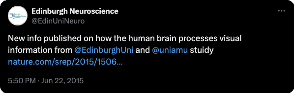
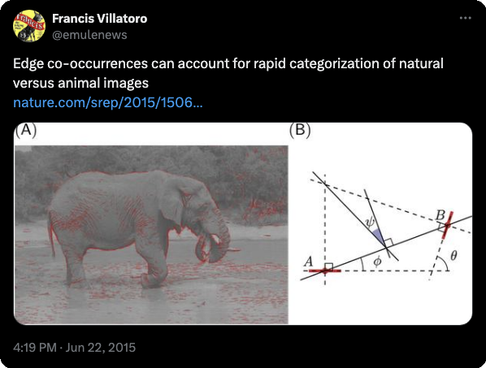

* [supplementary information](https://www.nature.com/article-assets/npg/srep/2015/150622/srep11400/extref/srep11400-s1.pdf)
* [supplementary material](PerrinetBednar15supplementary.pdf)
# A study of how people can quickly spot animals by sight is helping uncover the workings of the human brain.
Scientists examined why volunteers who were shown hundreds of pictures - some with animals and some without - were able to detect animals in as little as one-tenth of a second.
They found that one of the first parts of the brain to process visual information - the primary visual cortex - can control this fast response.
More complex parts of the brain are not required at this stage, contrary to what was previously thought.

{{< figure src="figure_model.jpg" title="Edge co-occurrences **(A)** An example image with the list of extracted edges overlaid. Each edge is represented by a red line segment which represents its position (center of segment), orientation, and scale (length of segment). We controlled the quality of the reconstruction from the edge information such that the residual energy was less than 5%. **(B)** The relationship between a reference edge *A* and another edge *B* can be quantified in terms of the difference between their orientations $\theta$, ratio of scale $\sigma$, distance $d$ between their centers, and difference of azimuth (angular location) $\phi$. Additionally, we define $\psi=\phi - \theta/2$, which is symmetric with respect to the choice of the reference edge; in particular, $\psi=0$ for co-circular edges. % (see text). As in~\citet{Geisler01}, edges outside a central circular mask are discarded in the computation of the statistics to avoid artifacts. (Image credit: [Andrew Shiva, Creative Commons Attribution-Share Alike 3.0 Unported license](https://commons.wikimedia.org/wiki/File:Elephant_/%28Loxodonta_Africana/%29_05.jpg)). This is used to compute the chevron map in Figure~2." numbered="true" >}}

{{< figure src="figure_chevrons.png" title="The probability distribution function $p(\psi, \theta)$ represents the distribution of the different geometrical arrangements of edges' angles, which we call a chevron map. We show here the histogram for non-animal natural images, illustrating the preference for co-linear edge configurations. For each chevron configuration, deeper and deeper red circles indicate configurations that are more and more likely with respect to a uniform prior, with an average maximum of about $3$ times more likely, and deeper and deeper blue circles indicate configurations less likely than a flat prior (with a minimum of about $0.8$ times as likely). Conveniently, this chevron map shows in one graph that non-animal natural images have on average a preference for co-linear and parallel edges, (the horizontal middle axis) and orthogonal angles (the top and bottom rows),along with a slight preference for co-circular configurations (for $\psi=0$ and $\psi=\pm \frac \pi 2$, just above and below the central row). We compare chevron maps in different image categories in Figure~3." numbered="true" >}}

{{< figure src="figure_chevrons2.png" title="As for Figure 2, we show the probability of edge configurations as chevron maps for two databases (man-made, animal). Here, we show the ratio of histogram counts relative to that of the non-animal natural image dataset. Deeper and deeper red circles indicate configurations that are more and more likely (and blue respectively less likely) with respect to the histogram computed for non-animal images. In the left plot, the animal images exhibit relatively more circular continuations and converging angles (red chevrons in the central vertical axis) relative to non-animal natural images, at the expense of co-linear, parallel, and orthogonal configurations (blue circles along the middle horizontal axis). The man-made images have strikingly more co-linear features (central circle), which reflects the prevalence of long, straight lines in the cage images in that dataset. We use this representation to categorize images from these different categories in Figure~4." numbered="true" >}}
{{< figure src="figure_results.png" title="Classification results. To quantify the difference in low-level feature statistics across categories (see Figure~3, we used a standard Support Vector Machine (SVM) classifier to measure how each representation affected the classifier's reliability for identifying the image category. For each individual image, we constructed a vector of features as either (FO) the histogram of first-order statistics as the histogram of edges' orientations, (CM) the chevron map subset of the second-order statistics, (i.e., the two-dimensional histogram of relative orientation and azimuth; see Figure 2 ), or (SO) the full, four-dimensional histogram of second-order statistics (i.e., all parameters of the edge co-occurrences). We gathered these vectors for each different class of images and report here the results of the SVM classifier using an F1 score (50\% represents chance level). While it was expected that differences would be clear between non-animal natural images versus laboratory (man-made) images, results are still quite high for classifying animal images versus non-animal natural images, and are in the range reported by~\citet{Serre07} (F1 score of 80\% for human observers and 82\% for their model), even using the CM features alone. We further extend this results to the psychophysical results of Serre et al. (2007) in Figure 5." numbered="true" >}}
{{< figure src="figure_FA_humans.png" title="To see whether the patterns of errors made by humans are consistent with our model, we studied the second-order statistics of the 50 non-animal images that human subjects in Serre et al. (2007) most commonly falsely reported as having an animal. We call this set of images the false-alarm image dataset. (Left) This chevron map plot shows the ratio between the second-order statistics of the false-alarm images and the full non-animal natural image dataset, computed as in Figure 3 (left). Just as for the images that actually do contain animals (Figure~3, left), the images falsely reported as having animals have more co-circular and converging (red chevrons) and fewer collinear and orthogonal configurations (blue chevrons). (Right) To quantify this similarity, we computed the Kullback-Leibler distance between the histogram of each of these images from the false-alarm image dataset, and the average histogram of each class. The difference between these two distances gives a quantitative measure of how close each image is to the average histograms for each class. Consistent with the idea that humans are using edge co-occurences to do rapid image categorization, the 50 non-animal images that were worst classified are biased toward the animal histogram ($d' = 1.04$), while the 550 best classified non-animal images are closer to the non-animal histogram. " numbered="true" >}}

## Communiqué de presse INSB : Comment nait la première impression d'une scène visuelle

* [communiqué de presse](https://www.techno-science.net/actualite/comment-nait-premiere-impression-scene-visuelle-N14337.html)

> En modélisant notre capacité à distinguer un animal dans une scène visuelle, des chercheurs de l’Institut de Neurosciences de la Timone et de l’Université d'Edinburgh lèvent le voile sur certains des mystères de la perception visuelle. Ils démontrent que la classification très rapide par le cerveau d’une image contenant ou non un animal, est possible à un niveau de représentation relativement primitif à partir de régularités statistiques simples, et non, comme cela est généralement admis, après une longue série d'analyses visuelles de plus en plus abstraites. Cette étude est publiée dans la revue Scientific Reports. 

Classifier une image, par exemple en décidant si elle contient ou non un animal, est une des fonctions de base du cerveau. Dans le royaume animal, on comprend aisément qu’elle constitue une fonction vitale aussi bien pour des prédateurs que pour leurs proies. Les mécanismes sous-jacents sont de plus en plus étudiés aussi bien dans le domaine des systèmes d'intelligence artificielle que dans celui des Neurosciences, mais ils restent encore bien mystérieux pour les chercheurs. En effet, si les réseaux d'ordinateurs les plus avancés peuvent aujourd'hui aisément calculer numériquement des quantités phénoménales de données à partir de bases de données pharaoniques, même les systèmes les plus avancés de classification d'images n'égalent pas encore les capacités d'un jeune enfant!

Laurent Perrinet de l’Institut de Neurosciences de la Timone à Marseille et James Bednar de l’université d'Edinburgh en Écosse, ont modélisé la façon dont nous pouvons classer différentes catégories d'images. Leur l'objectif initial était de différencier des scènes visuelles naturelles de scènes d'intérieur, mais ils ont pu montrer que ce système simple de classification permettait aussi de détecter en une fraction de seconde des animaux dans une image. En effet, ils ont mis en évidence qu'un niveau de performance comparable à celui d’observateurs humains est atteignable tout en utilisant un niveau de représentation très primitif, et non, comme cela est généralement admis, après une longue série d'analyses visuelles de plus en plus abstraites (détection des yeux et des membres, puis de la tête et du corps, etc...). 

Cette représentation primitive se base sur les modèles existants de représentation des images dans les aires visuelles de bas niveau des primates. On estime en effet que dans le cortex visuel primaire les images visuelles sont représentées dans l'activité neurale comme l'organisation de contours élémentaires, à la manière d’un peintre qui dessine une silhouette en une série de coups de pinceau. Une des innovations majeures dans cette étude consiste à simplement utiliser la fréquence des configurations entre des paires de contours élémentaires comme représentation d'entrée utilisée pour le classificateur. 

Pour arriver à ce résultat, les chercheurs ont utilisé des modèles mathématiques de la représentation des images dans le cortex visuel primaire et en particulier les inter-relations entre des éléments de contours voisins. En étudiant les résultats de l'analyse, on note que dans les images naturelles, des contours parallèles sont observés majoritairement, signe que les contours et textures présents dans les images contiennent en majorité des alignements. C'est encore plus vrai dans les environnements artificiels comme dans une scène d'intérieur (par exemple un bureau) où les bords francs dominent. On montre aussi que les objets co-circulaires (c'est-à-dire des configurations symétriques) sont aussi relativement plus présents que des configurations aléatoires. 

La principale nouveauté de cette étude est de montrer que les images contenant un animal (quelle que soit son espèce ou sa position dans l'image) contiennent sensiblement plus de configurations symétriques. Cette différence suffit pour expliquer le niveau de performance de classification chez les humains quand on leur présente de telles scènes de façon très brève. 

Pour valider cette hypothèse, les chercheurs ont alors utilisé des données précédemment enregistrées dans lesquelles des volontaires regardaient et classifiaient des centaines d'images. En utilisant cette représentation primitive, ils ont mis en évidence qu'un programme très simple pouvait facilement classifier les images comme contenant ou non un animal, sans avoir besoin d’une connaissance plus élaborée sur les caractéristiques de l’animal comme sa position, sa taille ou son orientation sur l’image. 

Cette découverte peut accélérer le développement de requêtes via des images dans les moteurs de recherche, comme Google et Facebook, car elle permet une classification simple et robuste grâce à des caractéristiques statistiques de bas niveau basées sur la géométrie des objets. Elle pourrait ainsi améliorer l'efficacité de tels algorithmes. Toutefois, et comme cela a été mis en évidence dans la psychophysique humaine, les catégories visuelles doivent être visuellement assez distinctes: ce traitement rapide ne permet pas, par exemple, de distinguer une scène de montagne d'une scène de mer. De manière surprenante, les chercheurs ont montré que lorsque les humains se trompent en classifiant de manière erronée une image comme contenant un animal, le programme a tendance à se tromper de la même façon! En utilisant des modèles mathématiques, on peut donc imaginer synthétiser des images d'animaux qui en fait, n'en contiendraient pas. Ces "chimères" seront sûrement très utiles pour percer encore plus les mystères du système visuel.

Dans le futur, l'extension de cette représentation calculée sur l'ensemble de l'image pourrait être améliorée en la couplant à des processus de classification locaux permettant de déterminer par exemple la position de l'objet à classifier et de segmenter progressivement la figure du fond afin  de diminuer ainsi les distractions.
 
{{< figure src="figure_synthesis_FR.png" title="TÀ partir d'une image naturelle (en haut à gauche), les chercheurs ont déterminé la façon la plus efficace de la représenter comme une succession de contours élémentaires orientés. Sur cet exemple, l'image est décomposée en contours élémentaires (marqués en rouge) et l'image correspond à sa reconstruction à partir de cette représentation, gage d'une représentation correcte de l'image. Le schéma (en bas à gauche) décrit alors les relations géométriques pour chaque paire de contours élémentaires (dénotés ici A et B) et en particulier la différence entre leurs orientations (cette différence est nulle pour des contours parallèles) ainsi que leur différence d'azimuth. Une valeur nulle de cette dernière indiquant une symétrie, c'est-à-dire que ces contours sont co-circulaires. On peut alors compiler les statistiques des différentes configurations possibles sur des bases de données de 600 images contenant ou ne contenant pas d'animal. On voit alors que les images contenant un animal présentent relativement moins de configurations parallèles (disques bleus, jusqu'à 50% de moins) et plus de configurations co-circulaires, c'est à dire le long de l'axe vertical médian (disques rouges, jusqu'à 20% d'occurences en plus). Cette différence, aussi tenue soit elle, permet alors de classifier une image pour permettre de deviner si elle contient ou non un animal." numbered="true" >}}

