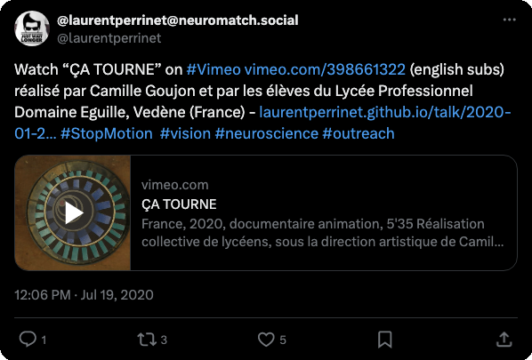


* ÇA TOURNE a été sélectionné pour participer à la compétition du « Alexandre Trauner ART/Film Festival » (Szolnok, Hongrie) : http://www.ataff.hu/
* visible aux Soirée Courts Métrages Ciné Rencontre de la Ville de Berre l'Étang https://www.berreletang.fr/soiree-courts-metrages?periode=2021-04-30%2017%3A23%3A26
* ÇA TOURNE de Camille Goujon, a été sélectionné au 27ème Festival national du film d'animation de Rennes Métropole, dans la catégorie Autoproductions du 7 au 11 octobre 2021 http://festival-film-animation.fr/
* le court-métrage a été sélectionné pour participer au « Happy Valley Animation Festival » (Pennsylvanie, USA) : https://happyvalleyanimationfestival.org/
* Le film "ÇA TOURNE" a été sélectionné pour faire partie de la compétition catégorie «FILMS SCOLAIRES" diffusée du 4 au 7 novembre 2020 dans le cadre du festival "7ème Art Jeunes Talent! : http://www.festivaltournezjeunesse.com
* Dans le cadre d'un projet Région (APERLA) les élèves de seconde Bac Pro Menuisiers agenceurs ont conçu ce film sous la direction de leur professeur Mme Bomont et  sous la direction artistique de [Camille Goujon](https://www.youtube.com/user/camillegoujon1/videos), artiste et cinéaste d'animation https://www.domaine-eguilles.fr/realisation-collective-de-lyceens-sous-la-direction-artistique-de-camille-goujon-artiste-et-cineaste-d-animation
* Ce court métrage fait partie des 7 films réalisés dans le cadre des « Ateliers de réalisation Cinésciences » proposés par l’association Polly Maggoo http://festivalrisc.org/films-dateliers/
* ref sur http://www.lussasdoc.org/film-ca_tourne-1,53288.html
* Le texte de cette présentation est reprise dans cet article de [The Conversation](https://laurentperrinet.github.io/publication/perrinet-19-temps/) ([lien direct](https://theconversation.com/temps-et-cerveau-comment-notre-perception-nous-fait-voyager-dans-le-temps-127567)).
* Voir la @ [présentation au NeuroStories]() sur un thème similaire
