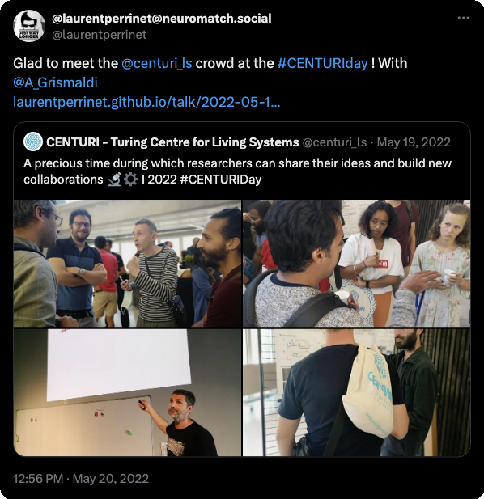

---
authors:
- Antoine Grimaldi
- Laurent U Perrinet
date: 2022-05-19 09:00:00
event: second CENTURI Scientific Day
event_url: https://centuri-livingsystems.org/events/centuri-scientific-day-3/
featured: false
- aprovis3D
image:
  alt_text: AG ready for the talk.
  caption: LP
  focal_point: Smart
  placement: 1
  preview_only: false
links:
- name: URL
  url: https://centuri-livingsystems.org/events/centuri-scientific-day-3/
location: Marseille (France)
publication: '*second CENTURI Scientific Day*'
publication_types:
- inproceedings
publishDate: 2022-05-19T10:44:45.446866Z
title: Polychrony detection using heterogeneous delays
tags: ["efficient-coding", "event-based-vision", "homeostasis", "motion-perception", "neuromorphic-computing"]
categories: ["NeuroAI & Machine Learning", "Outreach & Public Engagement"]
projects: [""]
---
* Follow this future presentations 

* followed-up as a poster: 
* for event-based motion detection, see: 
