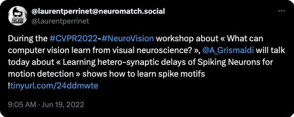

--- 
authors:
- Antoine Grimaldi
- Laurent U Perrinet
date: 2022-06-19 09:00:00
draft: false
event: NeuroVision Workshop in conjunction with CVPR 2022
featured: false
image:
  focal_point: Smart
  preview_only: false
lastmod: 2022-05-20 12:34:18+02:00
links:
- name: URL
  url: https://sites.google.com/uci.edu/neurovision2022/schedule
location: New Orleans (virtual)
publication: '*NeuroVision Workshop in conjunction with CVPR 2022*'
publication_types:
- inproceedings
publishDate: '2022-05-20T10:34:17.824678Z'
title: Learning heterogeneous delays of Spiking Neurons for motion detection
tags:
- efficient-coding
- event-based-vision
- homeostasis
- neuromorphic-computing
- spiking-neural-networks
categories:
- NeuroAI & Machine Learning
projects:
- tout-public
---

* for a follow-up, check out 
